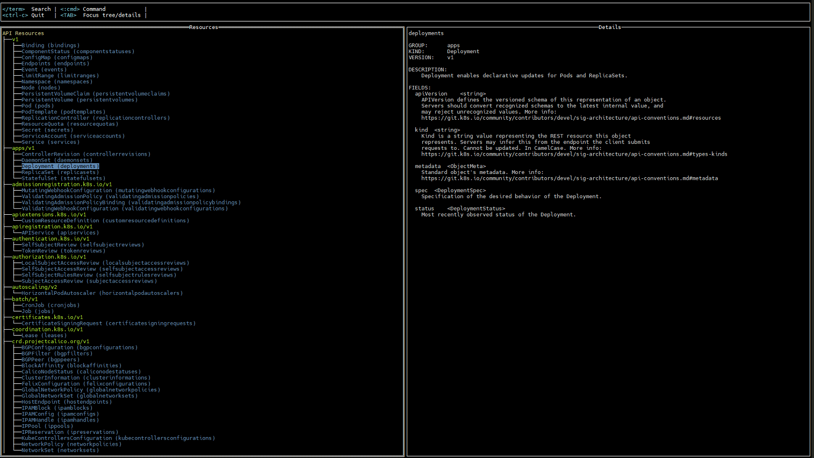
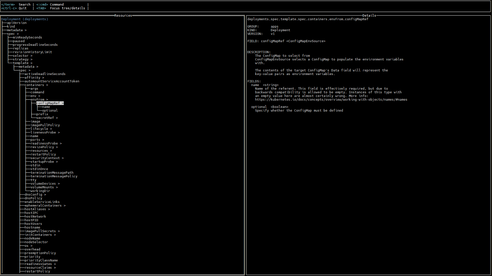

# **kubectl-apidocs**

_A `kubectl` plugin for learning about API resource documentation in a tree view format._

---

## **Installation**

### Using `krew`

1. Install the [Krew](https://krew.sigs.k8s.io/docs/user-guide/setup/) plugin manager if you haven’t already.
2. Run the following command:
   ```bash
   kubectl krew install apidocs
   ```
3. Verify installation:
   ```bash
   kubectl apidocs --version
   ```

### Manual Installation

1. Download the latest binary for your platform from
   the [Releases page](https://github.com/hashmap-kz/kubectl-apidocs/releases).
2. Place the binary in your system's `PATH` (e.g., `/usr/local/bin`).
3. Example installation script for Unix-Based OS:
   ```bash
   (
     set -euo pipefail

     OS="$(uname | tr '[:upper:]' '[:lower:]')"
     ARCH="$(uname -m | sed -e 's/x86_64/amd64/' -e 's/\(arm\)\(64\)\?.*/\1\2/' -e 's/aarch64$/arm64/')"
     TAG="$(curl -s https://api.github.com/repos/hashmap-kz/kubectl-apidocs/releases/latest | jq -r .tag_name)"

     curl -L "https://github.com/hashmap-kz/kubectl-apidocs/releases/download/${TAG}/kubectl-envsubst_${TAG}_${OS}_${ARCH}.tar.gz" |
       tar -xzf - -C /usr/local/bin && chmod +x /usr/local/bin/kubectl-apidocs
   )
   ```
4. Verify installation:
   ```bash
   kubectl apidocs --version
   ```

--- 

## Examples




---

## **Contributing**

We welcome contributions! To contribute: see the [Contribution](CONTRIBUTING.md) guidelines.

---

## **License**

This project is licensed under the Apache License 2.0 - see the [LICENSE](LICENSE) file for details.

---

## **Additional Resources**

For more information, visit the [project repository](https://github.com/hashmap-kz/kubectl-apidocs).

---
